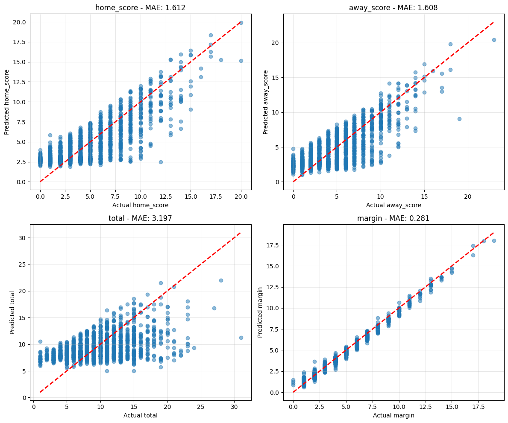
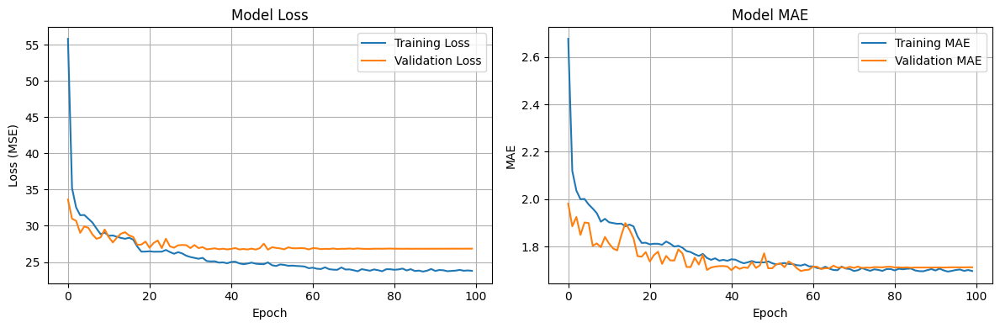
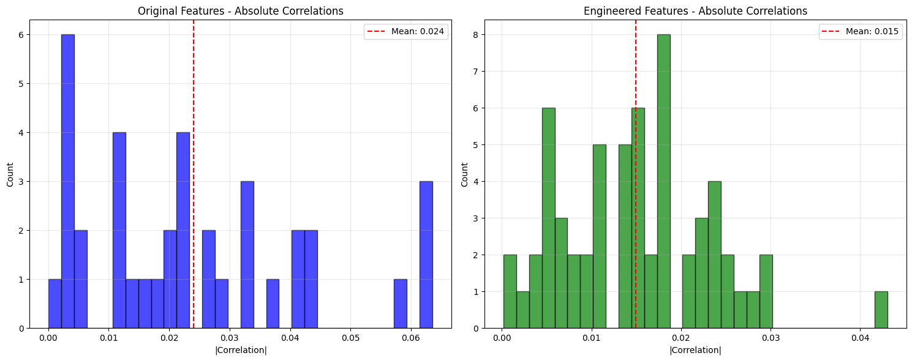

# MLB Game Score Prediction with a Multi-Output Neural Network


A deep learning project that predicts Major League Baseball game outcomes at a
finer grain than the usual win/loss classification: a single neural network
simultaneously forecasts the **home score**, **away score**, **total runs**, and
**margin of victory** for each game, trained on five seasons of historical team
performance data (2016–2021, ~11,600 games).

<p align="center">
  
</p>

## Highlights

- **Multi-output regression** — one model, four interrelated targets, letting
  shared hidden representations act as implicit regularization.
- **Consistency-aware custom loss** — a TensorFlow loss function that penalizes
  predictions where `home + away ≠ total` or `|home − away| ≠ margin`, so the
  four outputs stay mathematically coherent.
- **Leakage-safe feature engineering** — 144+ features built exclusively from
  *trailing* 10-game rolling averages (the current game is excluded via
  `shift(1)`), so every input is known before first pitch.
- **Ratio features that rescued the model** — raw team statistics correlated
  with outcomes at only |r| ≤ 0.12; engineering home-vs-away ratio features
  (e.g. an Offensive Power Ratio of AVG × SLG × OBP) tripled the strongest
  correlation to 0.35 and moved the model past mean-prediction behavior.
- **Bayesian hyperparameter optimization** — architecture, activation,
  dropout, batch norm, optimizer, and learning rate tuned with Keras Tuner
  (32 trials).

## Results

Test-set performance on 1,737 held-out games:

| Target | MAE | RMSE |
|---|---|---|
| Home score | 1.61 | 2.00 |
| Away score | 1.61 | 2.00 |
| Total runs | 3.20 | 3.98 |
| Margin of victory | 0.28 | 0.36 |

For context: MLB teams average ~4.4 runs per game with a standard deviation of
~2.9, so a per-team MAE of 1.6 runs is roughly a 30% improvement over
predicting the mean.

The winning architecture from the Bayesian search was compact: **2 hidden
layers × 95 units, PReLU activations, dropout 0.4, no batch norm, Adam @ 0.01**
— a reminder that on tabular data of this size, small well-regularized
networks beat deep ones.

<p align="center">
  
</p>

## How It Works

```
games.csv ─┐
hitters ───┼─► clean & merge ─► trailing 10-game ─► home/away ratio &  ─► scale ─► 4-output NN
pitchers ──┘   (per game)       rolling averages     composite features            (custom loss)
```

1. **Data cleaning** (`src/mlb_prediction/data.py`) — filters to regular-season
   9-inning games, aggregates per-player batting lines to team totals, and
   merges games, hitting, and pitching into one row per game.
2. **Feature engineering** (`features.py`) — computes trailing rolling averages
   per team, then converts them into matchup features: ratios, log-ratios,
   differences, and domain-driven composites (Offensive Power Ratio, Pitching
   Dominance K/BB comparison, Run Efficiency). Laplace smoothing and ratio
   clipping keep near-zero denominators from producing extreme values.
3. **Model** (`model.py`) — a tunable Keras Sequential network with a 4-neuron
   linear output head and the consistency-aware loss:

   `L = Σ MSE(target_i) + 0.2 · [ MSE(home + away, total) + MSE(|home − away|, margin) ]`

4. **Training** (`training.py`) — 70/15/15 train/validation/test split,
   features standardized with statistics fit on the training set only,
   Bayesian hyperparameter search, then final training with early stopping,
   learning-rate reduction on plateau, and checkpointing.
5. **Evaluation** (`evaluation.py`) — per-target MAE/RMSE and
   predicted-vs-actual diagnostics.

The full narrative — EDA, experiments, analysis, and discussion — lives in
[`notebooks/mlb-score-prediction.ipynb`](notebooks/mlb-score-prediction.ipynb).

<p align="center">
  
</p>

## Repository Structure

```
├── notebooks/
│   └── mlb-score-prediction.ipynb   # Full analysis: EDA → features → model → results
├── src/mlb_prediction/              # Reusable package extracted from the notebook
│   ├── data.py                      # Loading, cleaning, merging raw CSVs
│   ├── features.py                  # Rolling averages, ratio & composite features
│   ├── eda.py                       # Exploratory analysis and plots
│   ├── preprocessing.py             # Splitting and normalization
│   ├── model.py                     # Architecture + consistency-aware loss
│   ├── training.py                  # Keras Tuner search and final training
│   └── evaluation.py                # Test-set metrics and diagnostics
├── tests/                           # Unit tests for the data/feature pipeline
├── docs/figures/                    # Key figures exported from the notebook
├── data/                            # Raw data location (gitignored; see data/README.md)
├── requirements.txt
└── pyproject.toml
```

## Getting Started

```bash
git clone https://github.com/chernobylx/Deep-Learning-Final-Project.git
cd Deep-Learning-Final-Project

python -m venv .venv && source .venv/bin/activate
pip install -r requirements.txt
pip install -e .          # makes `mlb_prediction` importable
```

Download the dataset (instructions in [`data/README.md`](data/README.md)):

```bash
kaggle datasets download josephvm/mlb-game-data -p data/raw --unzip
```

Then either open the notebook (`jupyter lab notebooks/mlb-score-prediction.ipynb`)
or drive the pipeline from the package:

```python
from mlb_prediction.data import build_game_dataset
from mlb_prediction.features import build_feature_matrix

merged = build_game_dataset("data/raw")
enhanced = build_feature_matrix(merged, windows=(10,))
```

Run the tests with `pytest`.

## Limitations & Future Work

- **Random split, not chronological.** The 70/15/15 split is random; a
  time-ordered split (train on past seasons, test on later ones) would give a
  stricter estimate of real-world forecasting performance and is the first
  thing I would change.
- **No game-day context.** Starting pitchers, weather, park factors, and
  lineup/injury information are absent — all are known pre-game and would
  likely help, especially for total runs.
- **Extremes are hard.** The model is conservative on very high- and very
  low-scoring games, a known consequence of MSE-style objectives on
  heavy-tailed targets.
- **Architectural extensions.** Sequence models (LSTM/attention over each
  team's recent games) and uncertainty quantification (MC dropout, quantile
  outputs) are natural next steps.

## Acknowledgments

- Dataset: [MLB Game Data](https://www.kaggle.com/datasets/josephvm/mlb-game-data)
  by Kaggle user josephvm.
- Built as the final project for *Introduction to Deep Learning* at CU Boulder.

## License

[MIT](LICENSE) © Jonathan Chernoch
